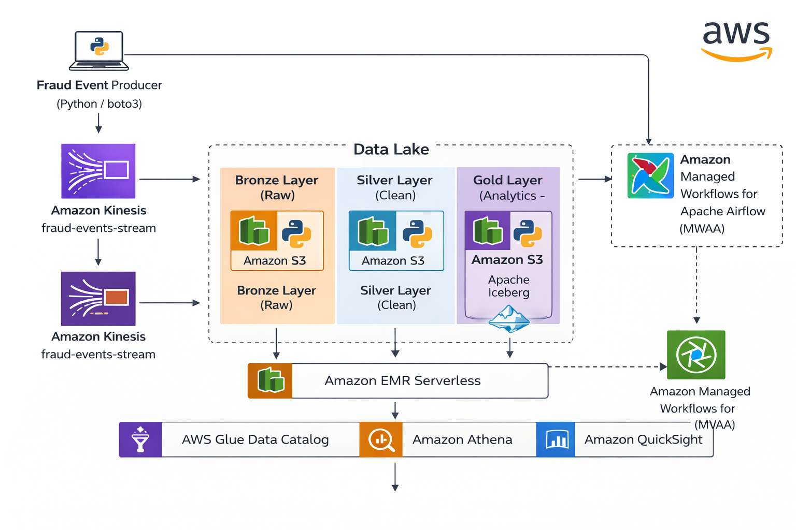

# Fraud Detection Data Platform (AWS Lakehouse)

A serverless-first Fraud Analytics platform built on AWS using a Lakehouse architecture (Bronze → Silver → Gold).

This project simulates fraud event ingestion, processing, transformation, and analytics using modern data engineering best practices.

---

## Architecture Diagram



---

# Architecture Overview

This solution implements:

- Streaming ingestion with Amazon Kinesis
- Medallion Architecture (Bronze → Silver → Gold)
- Apache Iceberg as Lakehouse table format
- EMR Serverless (Spark) for transformations
- AWS Glue Data Catalog for metadata
- Amazon Athena for SQL analytics
- Amazon QuickSight for BI dashboards
- MWAA (Airflow) for orchestration

---

## IAM Policy

The EMR Serverless execution role requires permissions defined in:

infra/iam/emr-serverless-glue-iceberg-policy.json

This policy grants access to:
- S3 Bronze/Silver/Gold layers
- AWS Glue Data Catalog
- Iceberg metadata

---

# End-to-End Flow

1. Fraud events are generated via a Python Producer
2. Events are streamed into Amazon Kinesis
3. Raw data lands in S3 Bronze layer
4. EMR Serverless transforms Bronze → Silver
5. Aggregations are written to Gold layer using Apache Iceberg
6. Tables are registered in Glue Data Catalog
7. Athena queries Iceberg tables
8. QuickSight visualizes KPIs and fraud insights

---

# Project Structure

```
fraud-detection-data-platform/
│
├── README.md
├── architecture/
│   ├── fraud-data-platform-architecture.md
│   └── fraud-aws-lakehouse-architecture-diagram.png
│
├── dags/
│   └── fraud_end_to_end_pipeline.py
│
├── producer/
│   └── kinesis-producer.py
│
└── jobs/
    ├── bronze/
    ├── silver/
    └── gold/
```

---

# AWS Buckets

Primary Data Lake:
```
s3://fraud-datalake-dev-use1-139961319000
```

MWAA Artifacts:
```
s3://fraud-mwaa-artifacts-dev-use1-139961319000
```

Athena Query Results:
```
s3://aws-athena-query-results-us-east-1-139961319000
```

Databricks Managed Storage (infra only):
```
s3://databricks-storage-7474655580663727
```

---

# Data Lake Design

## Bronze Layer (Raw)

Stores events exactly as received.

Partition pattern:
```
bronze/source=stream/entity=fraud_events/year=YYYY/month=MM/day=DD/
```

---

## Silver Layer (Clean)

Applies:
- Type casting
- Deduplication
- Timestamp normalization
- Data quality validation
- Enrichment (country, region, risk bucket)

Partition pattern:
```
silver/entity=fraud_events/year=YYYY/month=MM/day=DD/
```

---

## Gold Layer (Analytics – Iceberg)

Stored as Apache Iceberg tables:

```
gold_iceberg/<database>/<table>/
```

Example tables:
- fraud_events_kpis_daily
- fraud_events_geo_daily
- fraud_events_payment_method_daily

Queried via Athena and visualized in QuickSight.

---

# Key Technologies

| Layer | Technology |
|-------|------------|
| Ingestion | Amazon Kinesis |
| Storage | Amazon S3 |
| Processing | EMR Serverless (Spark) |
| Table Format | Apache Iceberg |
| Catalog | AWS Glue |
| SQL | Amazon Athena |
| BI | Amazon QuickSight |
| Orchestration | MWAA (Airflow) |

---

# Architectural Principles

- Serverless-first design
- Decoupled storage and compute
- Scalable and cost-efficient
- Partition-aware processing
- Lakehouse over S3
- Open table format (Iceberg)

---

# Future Improvements

- Iceberg compaction strategy
- Data quality automation
- Lake Formation governance
- CI/CD for Spark and Airflow
- Observability and SLA metrics

---

# Author

Leandro Santos  
Data Engineering | AWS | Lakehouse | Spark | Iceberg

---
