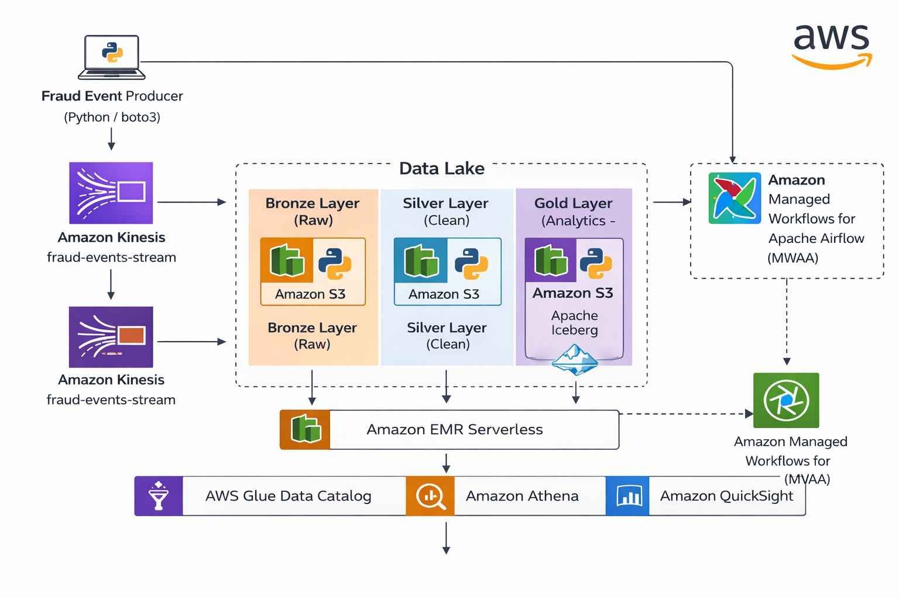
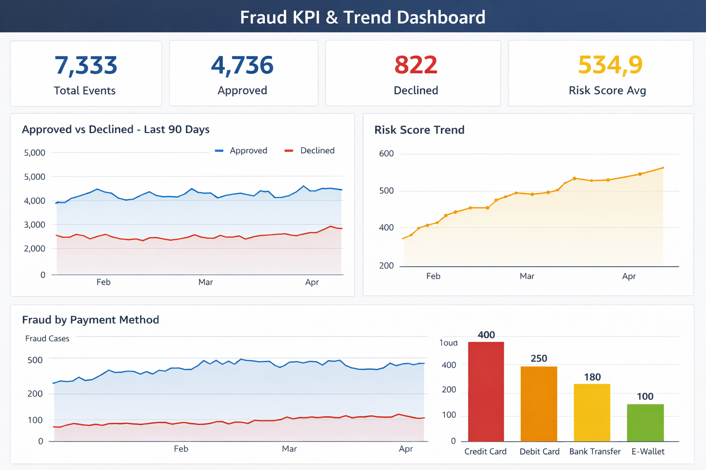
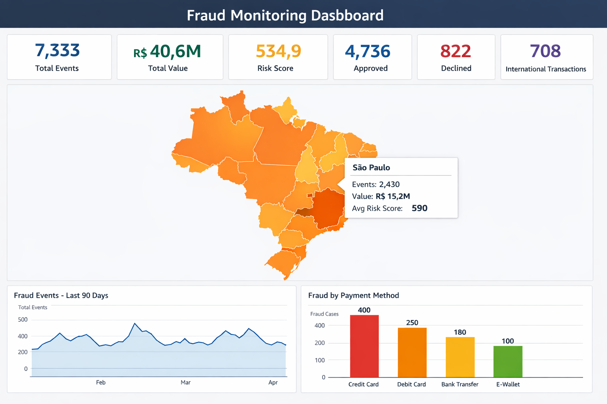

# Fraud Detection Data Platform (AWS Lakehouse)

A **serverless-first Fraud Analytics platform** built on AWS using a **Lakehouse architecture (Bronze → Silver → Gold)**.

This project simulates fraud event ingestion, processing, transformation, and analytics using modern **Data Engineering best practices**.

The platform demonstrates how to build a **scalable fraud analytics system** using streaming ingestion, distributed processing, open table formats, and serverless analytics.

---

# Architecture Diagram



---

# Architecture Overview

This solution implements a **modern Lakehouse architecture on AWS** composed of:

- **Streaming ingestion** with Amazon Kinesis
- **Medallion Architecture** (Bronze → Silver → Gold)
- **Apache Iceberg** as the open table format
- **EMR Serverless (Apache Spark)** for distributed data processing
- **AWS Glue Data Catalog** for metadata management
- **Amazon Athena** for SQL-based analytics
- **Amazon QuickSight** for dashboards and visualization
- **MWAA (Apache Airflow)** for pipeline orchestration

The architecture follows a **serverless-first design**, decoupling compute and storage to enable scalability and cost efficiency.

---

# Fraud Analytics Dashboards

The platform generates analytical datasets from the Gold layer and exposes them through Amazon QuickSight dashboards.

These dashboards allow fraud monitoring across multiple dimensions including geographic distribution, payment methods, risk scoring and transaction approval trends.

---

## Fraud KPI & Trend Dashboard



This dashboard provides high-level fraud KPIs including:

- Total fraud events
- Approved vs declined transactions
- Risk score trends
- Fraud cases by payment method

---

## Fraud Geographic Analysis Dashboard



This dashboard visualizes fraud distribution across regions, enabling detection of geographic fraud hotspots and regional risk patterns.

# End-to-End Data Flow

```
Fraud Event Producer (Python)
        ↓
Amazon Kinesis (Streaming Ingestion)
        ↓
S3 Data Lake — Bronze Layer (Raw Events)
        ↓
EMR Serverless (Spark) — Bronze → Silver Transformation
        ↓
S3 Data Lake — Silver Layer (Clean Data)
        ↓
EMR Serverless (Spark) — Aggregations
        ↓
S3 Data Lake — Gold Layer (Apache Iceberg Tables)
        ↓
AWS Glue Data Catalog
        ↓
Amazon Athena (SQL Analytics)
        ↓
Amazon QuickSight Dashboards
```

---

# Data Lake Design

The project implements the **Medallion Architecture** for structured data processing.

## Bronze Layer (Raw)

Stores events **exactly as received from the streaming source**.

Characteristics:

- Raw event ingestion
- Immutable append-only storage
- Schema-on-read
- Partitioned storage

Partition pattern:

```
bronze/source=stream/entity=fraud_events/year=YYYY/month=MM/day=DD/
```

---

## Silver Layer (Clean)

Applies data standardization and quality improvements:

- Type casting
- Deduplication
- Timestamp normalization
- Data quality validation
- Enrichment (country, region, risk bucket)

Partition pattern:

```
silver/entity=fraud_events/year=YYYY/month=MM/day=DD/
```

---

## Gold Layer (Analytics)

The Gold layer stores **aggregated analytical datasets** using **Apache Iceberg tables**.

Example tables:

- `fraud_events_kpis_daily`
- `fraud_events_geo_daily`
- `fraud_events_payment_method_daily`

Storage pattern:

```
gold_iceberg/<database>/<table>/
```

These tables are queried via **Athena** and visualized in **QuickSight**.

---

# Project Structure

```
fraud-detection-data-platform/
│
├── README.md
│
├── architecture/
│   ├── fraud-data-platform-architecture.md
│   └── fraud-aws-lakehouse-architecture-diagram.png
│
├── dags/
│   └── fraud_end_to_end_pipeline.py
│
├── producer/
│   └── kinesis-producer.py
│
└── jobs/
    ├── bronze/
    ├── silver/
    └── gold/
```

---

# AWS Resources

## Primary Data Lake

```
s3://fraud-datalake-dev-use1-139961319000
```

## MWAA Artifacts

```
s3://fraud-mwaa-artifacts-dev-use1-139961319000
```

## Athena Query Results

```
s3://aws-athena-query-results-us-east-1-139961319000
```

## Databricks Managed Storage (Infra Only)

```
s3://databricks-storage-7474655580663727
```

---

# Key Technologies

| Layer | Technology |
|------|-------------|
| Ingestion | Amazon Kinesis |
| Storage | Amazon S3 |
| Processing | EMR Serverless (Apache Spark) |
| Table Format | Apache Iceberg |
| Metadata Catalog | AWS Glue Data Catalog |
| SQL Analytics | Amazon Athena |
| Business Intelligence | Amazon QuickSight |
| Orchestration | MWAA (Apache Airflow) |
| Language | Python |
| Infrastructure | Terraform |

---

# IAM Policy

The **EMR Serverless execution role** requires permissions defined in:

```
infra/iam/emr-serverless-glue-iceberg-policy.json
```

This policy grants access to:

- S3 Bronze/Silver/Gold layers
- AWS Glue Data Catalog
- Iceberg metadata

---

# Architectural Principles

The platform was designed following modern **Data Platform principles**:

- Serverless-first architecture
- Decoupled storage and compute
- Open table formats (Iceberg)
- Partition-aware processing
- Scalable distributed compute
- Lakehouse architecture over S3

---

# Future Improvements

Potential improvements for production-grade deployment:

- Iceberg compaction strategy
- Data quality automation
- Lake Formation governance
- CI/CD for Spark and Airflow pipelines
- Observability and SLA monitoring
- Automated schema evolution handling

---

# Author

**Leandro Santos**

Data Engineering | AWS | Lakehouse | Spark | Iceberg

GitHub: https://github.com/leandroslax